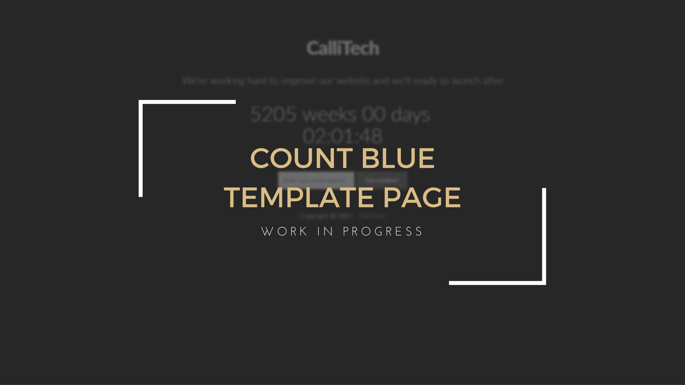
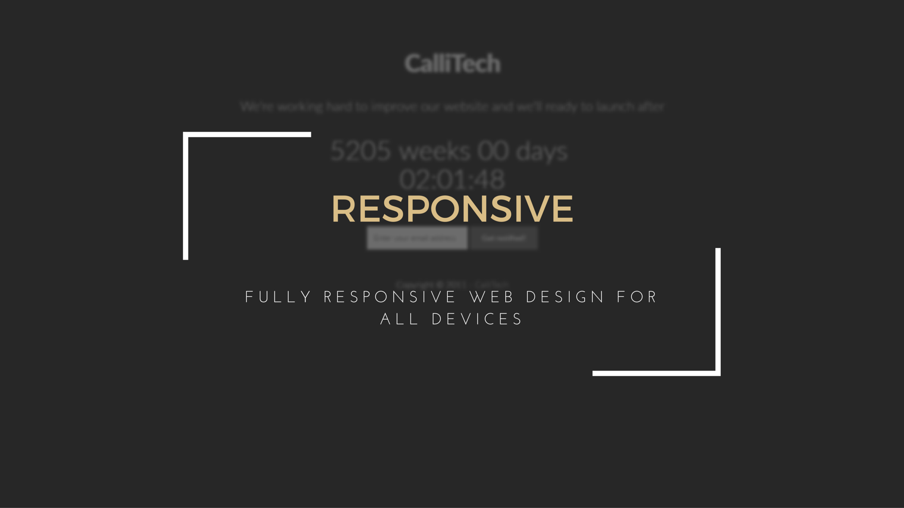
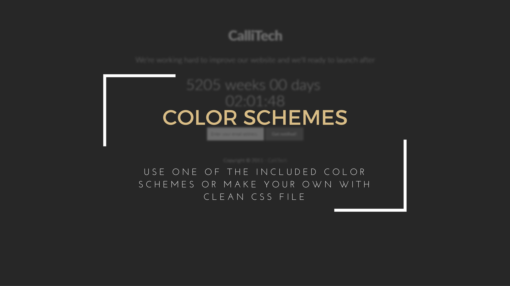

# Count Blue Template Page
## Work In Progress (WIP)

<!-- BADGES/ -->

 

<!-- /BADGES -->

### Description

This is a modern and interactive Work In Progress Page that you can easily and rapidly customize. While your site or product is underway, use the included newsletter form to collect prospective customers and visitors. The template is ready-to-go and has features cool animations. If you’re looking for something different and trendy, that’s your top choice.

### Feature List

- Fully responsive web design for all devices;

- Use one of the included color schemes or make your own with clean CSS file;

- Compatible on all major modern browsers;

- Well documented;

- Include 12 Months of support by CalliTech;

### Project Information

##### Test Page

Please visit ou [Test Page](http://wipcb.calli.tech/) and see the project working:

  

##### Date

25/03/2016

##### Authors

Francisco Maria Calisto ([FMCalisto](https://github.com/FMCalisto))

##### Editors

Bruno Oliveira ([bruno-oliveira](https://github.com/bruno-oliveira))
